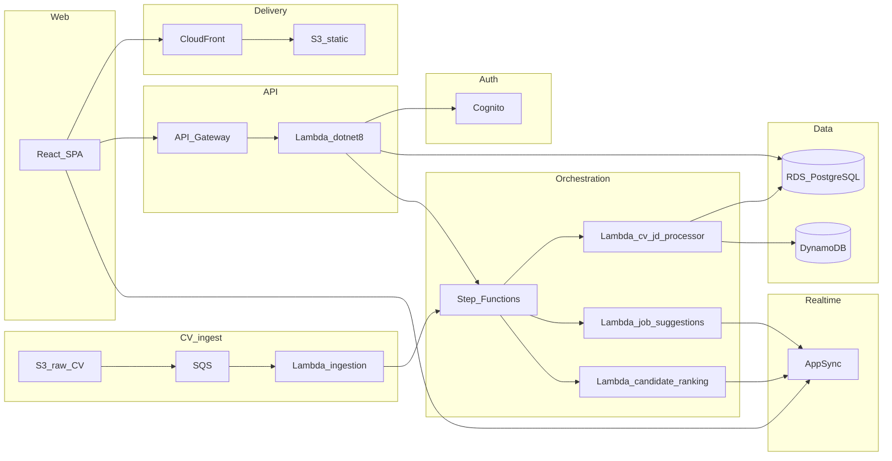

# SmartHire-AI

Smart hiring platform on AWS: **candidates** upload CVs and receive **job suggestions**; **recruiters** manage job postings and see **ranked candidates**. The web app is a **React (Vite) SPA** behind **Amazon CloudFront** and **Amazon S3**, with **Amazon Cognito** sign-in (including Google). Matching results stream to the browser through **AWS AppSync** GraphQL subscriptions so dashboards update without manual refresh.

## Architecture

---

## What the web application does

- **Candidate experience**: Sign in, upload a CV (PDF), and view suggested roles as the pipeline finishes processing. Updates can arrive in near real time over AppSync.
- **Recruiter experience**: Create and maintain jobs (job descriptions live in the relational database). When a job is created or updated, the backend starts processing so recruiters see ranked applicants on their dashboard, again with realtime pushes where configured.

Infrastructure and API behavior are defined as code: **Terraform** for the core AWS footprint and **AWS SAM** for the HTTP API layer (API Gateway + .NET Lambda).

---

## End-to-end flows (no pricing)

### Candidate path (CV upload)

1. The user uploads a **PDF** to **Amazon S3** under the `candidates/` prefix.
2. **S3 event notification** enqueues a message in **Amazon SQS** (CV parse queue).
3. **AWS Lambda** (`ingestion_trigger`) consumes the queue and starts an **AWS Step Functions** execution.
4. The state machine invokes **`cv_jd_processor`** (Python) for text extraction (e.g. **Amazon Textract**), enrichment (**Amazon Bedrock**, **Amazon Comprehend**), embeddings, and scoring against job data in **Amazon RDS (PostgreSQL)**.
5. The flow routes to **`job_suggestion_engine`** (container image from **Amazon ECR**), which writes tracking data to **Amazon DynamoDB** and publishes results via **AWS AppSync** so the SPA updates for that candidate.

### Recruiter path (job description)

1. Job description text is stored in **RDS** (not driven by S3 upload as the primary path).
2. The **.NET 8** API on **API Gateway + Lambda** calls **Step Functions** directly when a job is created or updated.
3. The same unified pipeline runs **`cv_jd_processor`**, then branches to **`candidate_ranking_engine`** for recruiter-side ranking.
4. Results are persisted and pushed through **AppSync** for the recruiter UI.

---

## Technology stack

| Area | Technologies |
|------|----------------|
| **Frontend** | React, Vite, TypeScript; hosted on S3 + CloudFront |
| **Auth** | Amazon Cognito (user pool, optional Google federation); JWT authorization on API Gateway |
| **Backend API** | AWS SAM, Amazon API Gateway, AWS Lambda (.NET 8), VPC access to RDS, AWS Secrets Manager |
| **CV / JD pipeline** | AWS Step Functions, AWS Lambda (Python 3.12 + container images on ECR), Amazon SQS (+ DLQ) |
| **AI & document** | Amazon Bedrock, Amazon Textract, Amazon Comprehend |
| **Data** | Amazon RDS (PostgreSQL), Amazon DynamoDB (application tracking), Amazon S3 (assets) |
| **Realtime** | AWS AppSync (GraphQL subscriptions / mutations) |
| **Infrastructure as code** | HashiCorp Terraform (`iac/terraform`), AWS SAM (`iac/sam`) |
| **CI/CD** | AWS CodePipeline, AWS CodeBuild, CodeStar Connections to GitHub (see Terraform modules) |
| **Observability** | Amazon CloudWatch, Amazon SNS (alarms for pipeline health) |

Optional pieces in Terraform include **AWS WAF** on CloudFront, **Route 53** + **ACM** for custom domains, **VPC** interface endpoints for AWS services, and **NAT** / bastion patterns depending on environment settings.

---

## Repository layout (high level)

- `frontend/` — SPA source
- `backend/` — .NET solution consumed by SAM
- `iac/terraform/` — VPC, RDS, Cognito, processing pipeline, frontend hosting, CI/CD, etc.
- `iac/sam/` — API Gateway + Lambda API template
- `iac/lambda/` — Python Lambdas and related assets for the pipeline
- `docs/` — Architecture and proposal notes (e.g. `docs/architecture-smart-matching.md`, `docs/_index.vi.md`)

---

## Documentation

For sequence diagrams, GraphQL contract details, and deeper design notes, see **[docs/architecture-smart-matching.md](docs/architecture-smart-matching.md)**.
