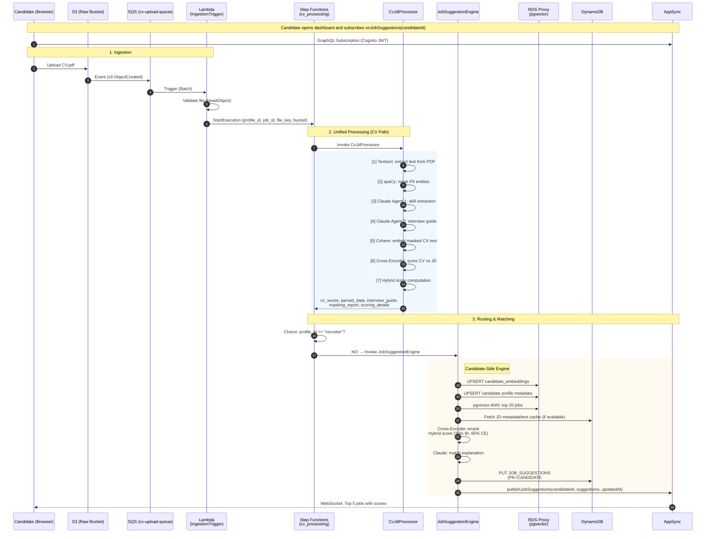

### A. Candidate Flow (CV Upload → Job Suggestions)

```mermaid
sequenceDiagram
    autonumber
    participant C as Candidate (Browser)
    participant S3 as S3 (Raw Bucket)
    participant SQS as SQS (cv-upload-queue)
    participant L1 as Lambda<br/>(IngestionTrigger)
    participant SF as Step Functions<br/>(cv_processing)
    participant PROC as CvJdProcessor
    participant SE as JobSuggestionEngine
    participant RDS as RDS Proxy<br/>(pgvector)
    participant DDB as DynamoDB
    participant APP as AppSync

  Note over C, APP: Candidate opens dashboard and subscribes onJobSuggestions(candidateId)
  C->>APP: GraphQL Subscription (Cognito JWT)

    Note over C, L1: 1. Ingestion
    C->>S3: Upload CV.pdf
    S3->>SQS: Event (s3:ObjectCreated)
    SQS->>L1: Trigger (Batch)
    L1->>L1: Validate file (HeadObject)
    L1->>SF: StartExecution (profile_id, job_id, file_key, bucket)

    Note over SF, PROC: 2. Unified Processing (CV Path)
    SF->>PROC: Invoke CvJdProcessor
    rect rgb(240, 248, 255)
        PROC->>PROC: [1] Textract: extract text from PDF
        PROC->>PROC: [2] spaCy: mask PII entities
        PROC->>PROC: [3] Claude Agent 1: skill extraction
        PROC->>PROC: [4] Claude Agent 2: interview guide
        PROC->>PROC: [5] Cohere: embed masked CV text
        PROC->>PROC: [6] Cross-Encoder: score CV vs JD
        PROC->>PROC: [7] Hybrid score computation
        PROC-->>SF: cv_vector, parsed_data, interview_guide,<br/>masking_report, scoring_details
    end

    Note over SF, APP: 3. Routing & Matching
    SF->>SF: Choice: profile_id == "recruiter"?
    SF->>SE: NO → Invoke JobSuggestionEngine

    rect rgb(255, 250, 240)
        Note right of SE: Candidate-Side Engine
        SE->>RDS: UPSERT candidate_embeddings
      SE->>RDS: UPSERT candidate profile metadata
        SE->>RDS: pgvector ANN: top 20 jobs
      SE->>DDB: Fetch JD metadata/text cache (if available)
        SE->>SE: Cross-Encoder rerank<br/>Hybrid score (35% BI, 65% CE)
        SE->>SE: Claude: match explanation
        SE->>DDB: PUT JOB_SUGGESTIONS<br/>(PK=CANDIDATE#{profile_id})
        SE->>APP: publishJobSuggestions(candidateId, suggestions, updatedAt)
    end

    APP-->>C: WebSocket: Top 5 jobs with scores
```

