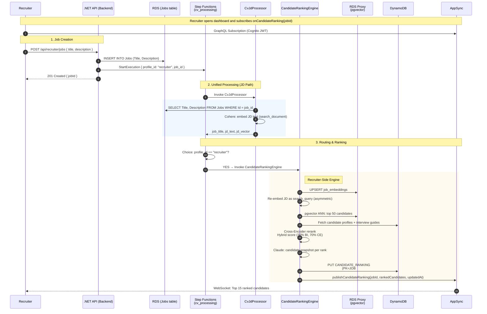
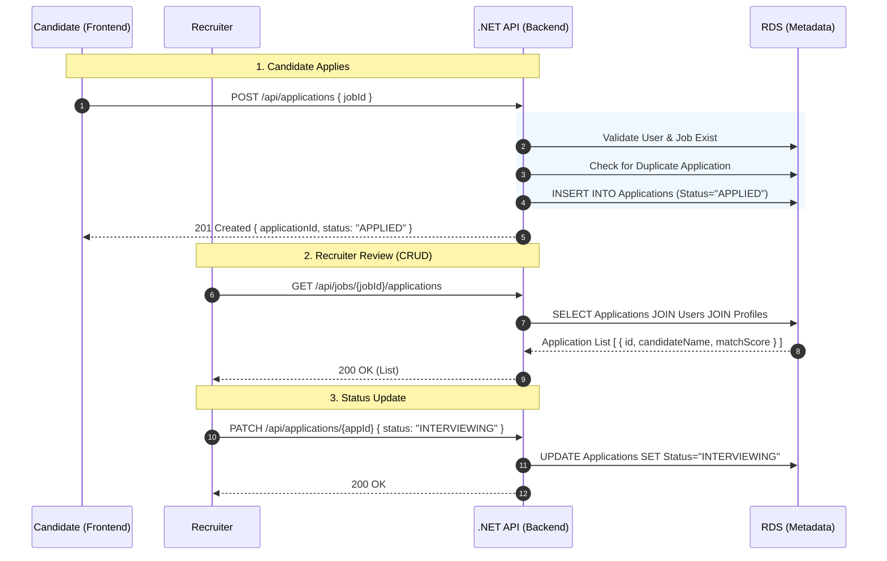
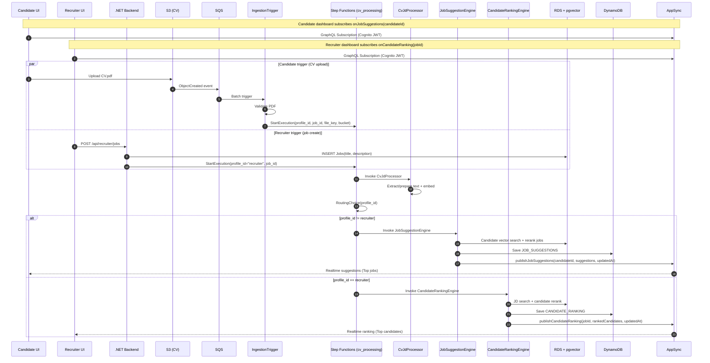

### A. Candidate Flow (CV Upload → Job Suggestions)

### B. Recruiter Flow (Job Create → Ranked Candidates)

### C. Application Management Flow (.NET Core CRUD)

### D. Master End-to-End Flow (Single View)

