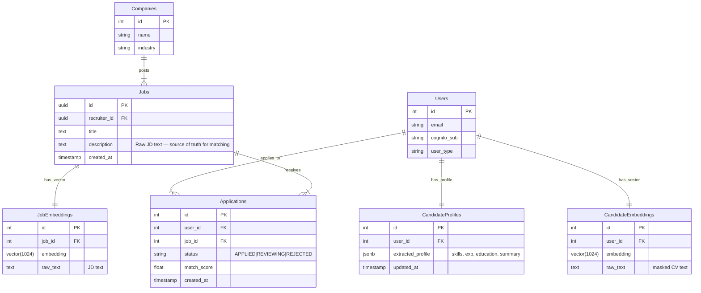

### A. Unified Database Schema

### B. Data Storage Strategy

#### 1. Raw Assets (Amazon S3)

- **Bucket**: `smarthire-raw-assets`
- **Paths**: `candidates/{userId}/cv.pdf`
- **Purpose**: Immutable backup and audit trail for CV PDFs.
- **Note**: JD PDFs are no longer uploaded to S3. JD text is stored in RDS `Jobs.Description`.

#### 2. Relational & Vector Data (Amazon RDS PostgreSQL)

Serves as the **Source of Truth** for business entities and semantic search.

- **Business Tables**: `Users`, `Jobs`, `Applications`, `Companies`.
- **AI Tables**: `CandidateProfiles` (AI-extracted profile data).
- **Pgvector**: `CandidateEmbeddings`, `JobEmbeddings` (1024-dim Cohere vectors).
- **JD Source**: `Jobs.Description` column is read directly by `CvJdProcessor` Lambda.

#### 3. Hot Store / Cache (Amazon DynamoDB)

- **Table**: `ApplicationTracking` (Single Table Design)
- **Purpose**: High-frequency read/write operations for real-time UI updates (suggestions, rankings, parse results).
